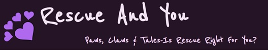
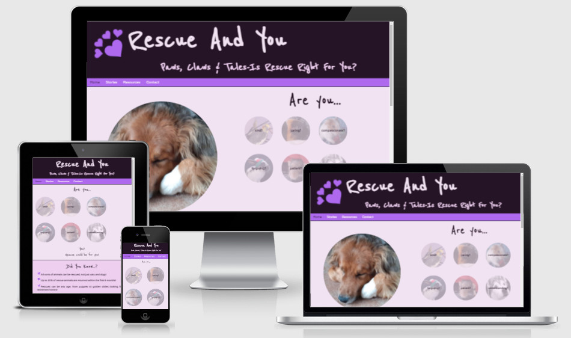
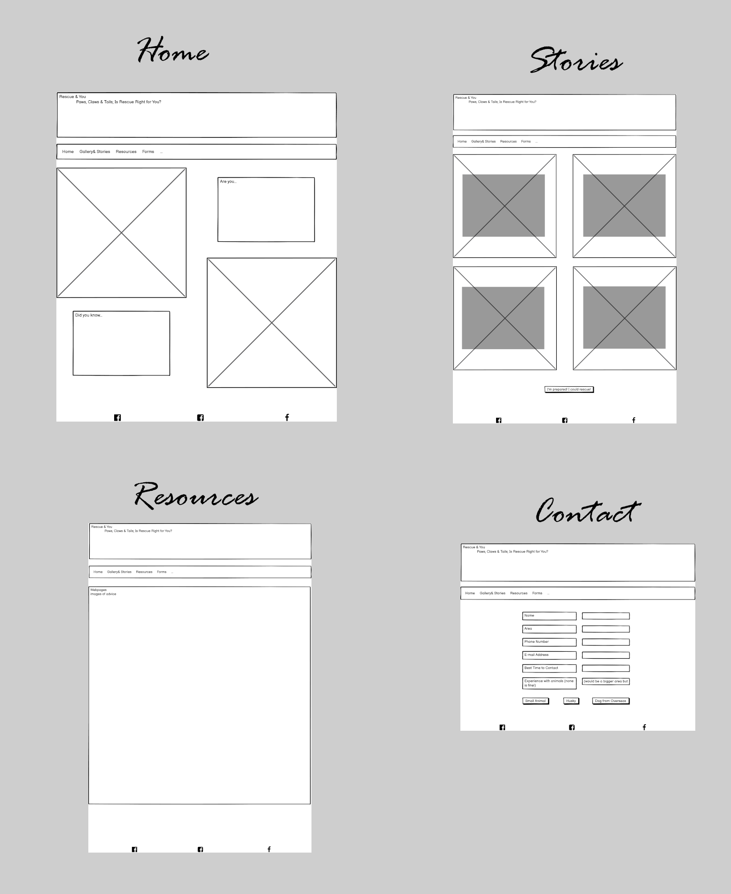
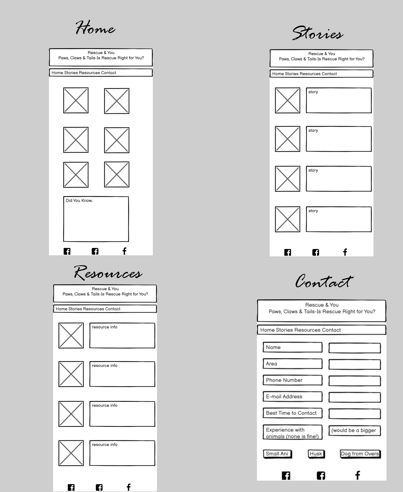
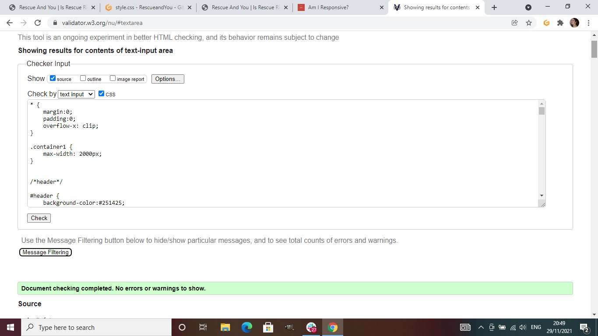
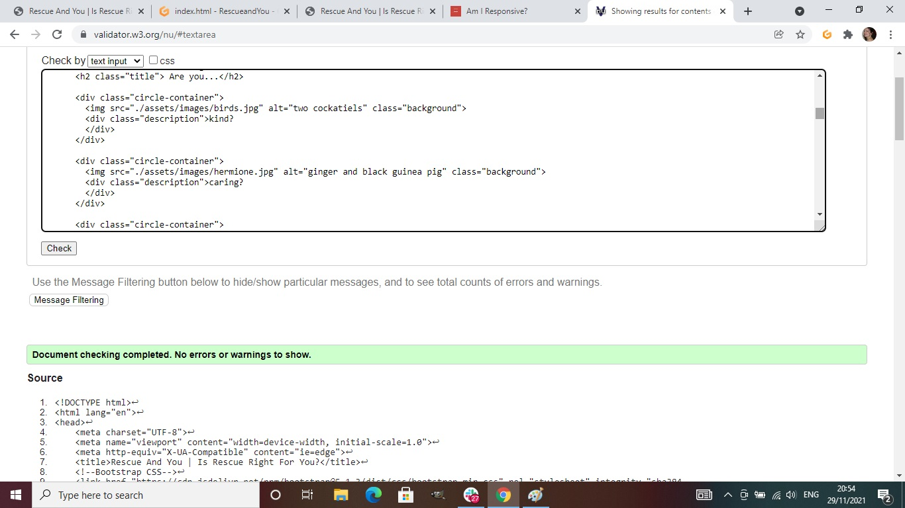
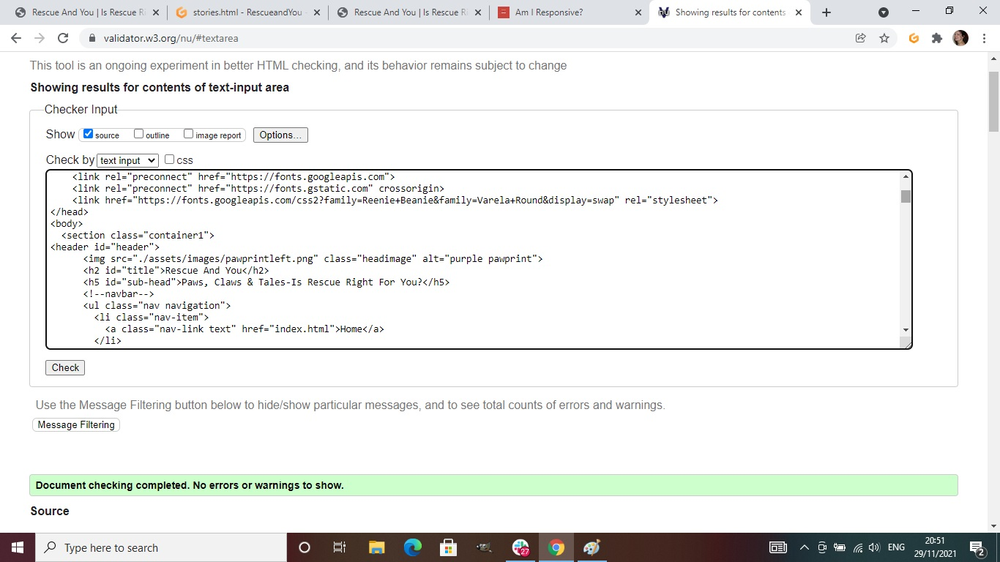
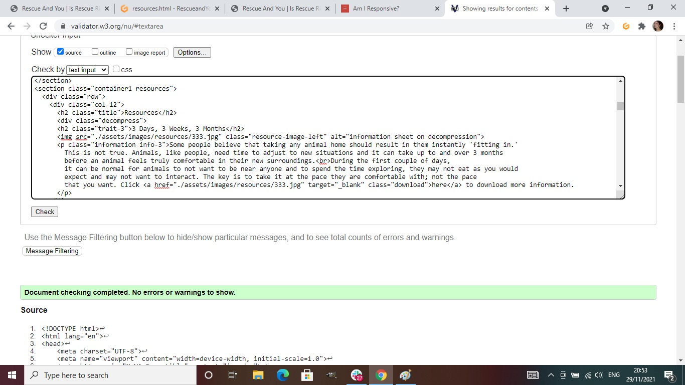
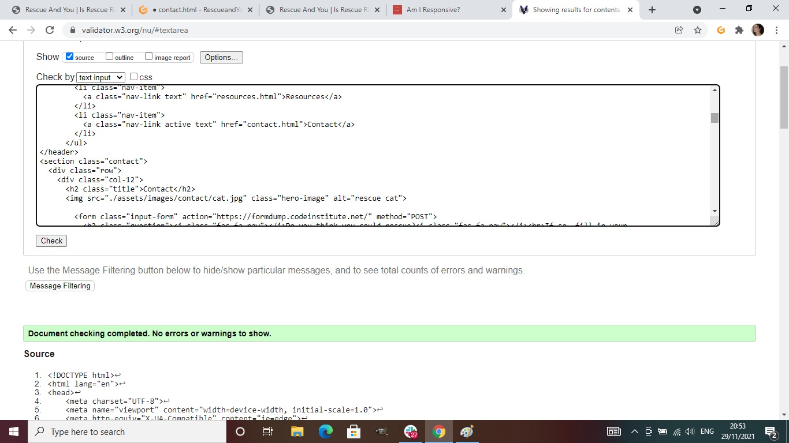
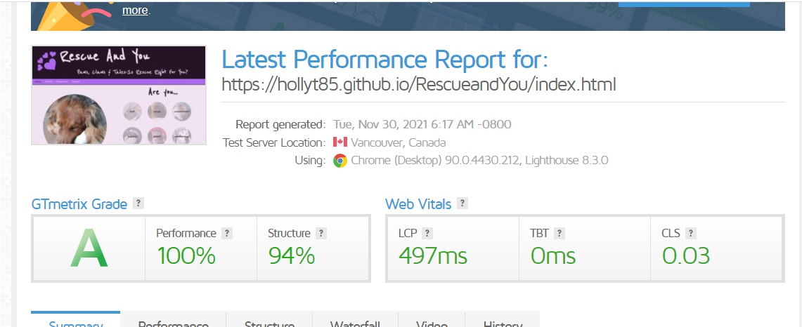

<u><b>Introduction</b></u>

Rescue and You is a website created to help people decide whether they should rescue an animal or not. It advertises three rescues (one small animal rescue, one breed specific rescue and one overseas rescue), to show people that there are many animals available for adoption of all species and breeds. 

<u><b>Site Overview & UX</b></u>

The site consists of 4 easy to navigate pages. The site is designed to be responsive on all screens and has been tested on a variety of devices. The colour scheme has 4 complementary colours, the logo is very simple and there is the use of only two fonts: Reenie Beanie & Varela Round. Font colours have been used to stand out against the colour of the background for viewing ease. 
Visitors to the site know which page they are on through use of a change of colour on the active page.
For ease of use (i.e less scrolling), some images have been removed for the mobile version to reduce the need to endlessly scroll.

<u>Home</u> The top of the page shows 6 character traits that, after research, were considered the most important when considering rescuing an animal. The bottom shares some facts about animal rescue. This is to get people thinking about whether they can cope with the difficulties that can arise from rescuing an animal.

<u>Stories</u> This page shares some real-life stories of animals which have been rescued from across the rescues as well as some of the difficulties that have been faced.

<u>Resources</u> Shares basic, useful information about how to tackle some of the more common problems when rescuing.

<u>Contact</u> Visitors to the site can use this page to express an interest in rescuing from one of the three animal rescues promoted on the page.

The pages follow similar formats; the stories and resource pages have their information in bubbles to make them stand out; the home page is clearly separated into two sections and the form page is simple with a hero image to make the page a little bit more interesting.

The whole site is simply designed and uses real-life rescue animal images on every page to ensure people get a real feel for what rescuing an animal is like; I did not want them to be distracted by bright, garish colours or irrelevant information.

<u><b>Wireframes</b></u>

I created my Wireframes using Balsamiq.

<u>Desktop</u>

<u>Mobile</u>

<u><b>User Stories</b></u>

<u>Users</u>

As a user, I want to know if rescuing an animal is right for me. 
As a user, I want to know how rescuing an animal can make a difference with the use of both pictures and text. 
As a user, I want to be able to contact some rescue centres. 
As a user, I want to know some of the problems which may occur when rescuing an animal and how to help an animal settle in. 
As a user, I’d like to see some facts about rescuing animals. 
As a user, I want to see information about how long it takes rescue animals to settle and how I can help them to do this. 
As a user, I want to understand what animals are available to rescue.

<u>Rescue Centres</u>

As a rescuer, I want people to make an informed decision about whether rescuing an animal is right for them to reduce the number of animals returned to rescue. 
As a rescuer, I want people to clearly see the difference that rescuing can make to an animal. 
As a rescuer, I want to be easy to contact and have initial information to hand easily. 
As a rescuer, I’d like people to know that rescuing an animal is not easy and requires patience and hard work. 
As a rescuer, I’d like people to see some facts about rescuing animals. 
As a rescuer, I want people to have easy access to appropriate information that will help them make a decision as to whether they can handle a rescue animal. 
As a rescuer, I want people to understand there are a variety of animals available for re-homing and rescue is not just for dogs and cats. 

<b><u>Testing & Code Validation</u></b>

The site has been tested on W3C Validator. On the index page there were a couple of unclosed tags. A lot of errors came from my images, the names of which had spaces in so I had to change these and remove the spaces. After these were completed, all pages passed through.

<u>CSS</u>

<u>Home</u>

<u>Stories</u>

<u>Resources</u>

<u>Contact</u>

The site was also tested on GTMetrix for speed. The results were positive:

Whilst testing, I made the decision to change some design features; primarily removing some images on mobile view and ensuring there was not a lot of scrolling on smaller screens. I also added the balloons to the resource and story pages to ensure each separate element stood out other than via their heading.

Form validation was also tested and will not be submitted without all areas being answered.

<u>Issues and Bugs</u>

I restarted the project with a new file due to the previous file becoming unresponsive. I couldn't figure out why and hit the same problem with my new site. I discovered it was a simple punctuation error where I was using # instead of . for my classes.

I had difficulty with getting font awesome to work for some time: I discovered I was trying to use icons which were not supported in the stylesheet I had used as it was an older version; I updated this and then there were no more issues.

In the footer, I had difficulty with getting everything aligned correctly over the pictures; this was one of the biggest challenges I faced. I tried a variety of ways including adding the file in CSS instead of HTML but I fixed the problem via some research and experimentation. Whilst I had it working in CSS, I was unhappy using this method as there is no option for alt text for accessibility when it is done this way.

Once I had published my website, some of my images wouldn't load; the filepath was not correct for some images. Once this was fixed, everything worked as it should.

<b><u>Deployment</u></b>

The site has been deployed via GitPages and can be found [here](https://hollyt85.github.io/RescueandYou/index.html).

<b><u>Technology</u></b>

<u>Languages Used</u>

CSS & HTML
Some Javascript from Bootstrap

<u>Tools</u>

[GitHub](https://github.com/) for buiding the webpage.

[GitHubPages](https://pages.github.com/) for webpage deployment.

[Bootstrap](https://getbootstrap.com/) for code for elements/

[FontAwesome](https://fontawesome.com/) for icons used.

[GoogleFonts](https://fonts.google.com/) for the fonts used in the project.

[Balsamiq](https://balsamiq.com/) to create wireframes.

[GIMPSoftware](https://www.gimp.org/) to edit photos.

[Paint](https://support.microsoft.com/en-us/windows/get-microsoft-paint-a6b9578c-ed1c-5b09-0699-4ed8115f9aa9) for pasting screenshots.

[GTMetrix](https://gtmetrix.com/) to check site speed.

[W3C](https://www.w3.org/) for code validation and also some hints and tips.

[AmIResponsive](http://ami.responsivedesign.is/#) to check responsivity of the site.

<b><u>Media</u></b>

Most images on the site were taken by myself. The two images which were not came from [Pexels](https://www.pexels.com/royalty-free-images/).

I also designed my own logo.

<b><u>Acknowledgements</u></b>

With thanks to Felipe Alarcon (mentor) and Stephen (5P lead; Slack forum) for their patience and advice.